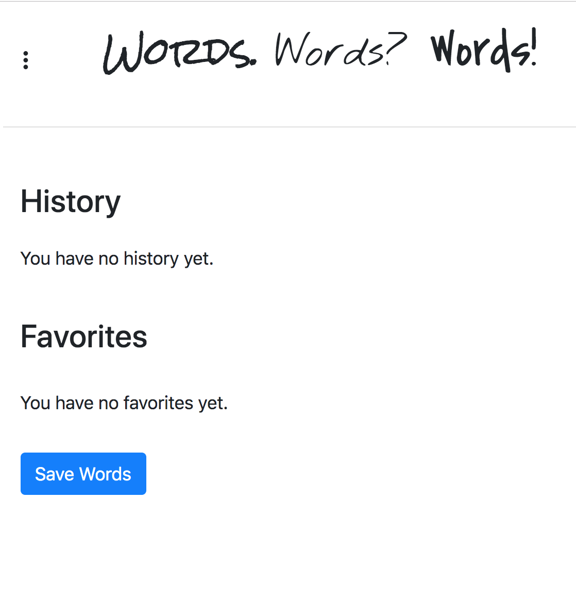

# Angular-Chrome-Extension-Datamuse

Angular with Typescript, Bootstrap, Materials, and [Datamuse API](https://www.datamuse.com/api/).

## Getting it Into Chrome

**ATTENTION. Any problems with latest build have been fixed. Latest dist added. Feel free to clone and load it up in chrome. Just added animations**

#

_latest build May 5th, 2019_
load unpacked extension in extension settings developer mode at this directory `dist/chrome-angular`. Icon should show in extensions (lil book icon).

## Development server

Run `npm install`, update dependencies in `package.json`, and finally-- `ng serve` for a dev server. Navigate to `http://localhost:4200/`. The app will automatically reload if you change any of the source files.

## Making Changes, Then Getting It Into Chrome

Run `ng build` to build the project, if the `dist` folder isn't present. Create `manifest.json` in `dist/chrome-angular`. Copy code from `/angular-chrome-extension/chrome-angular/src/manifest.json` to that file. Save, then upload `chrome-angular` folder with `load unpacked` under extensions with developer mode on.

## Wanna Check It Out In Browser?

`ng serve -o`

## Saving Words

Rather than having a server w/DB, the saving word feature is simple enough to just use `localStorage`. **_As of May 5th, 2019. localStorage holds favorites, but not history. _**

Features to works on :

- Vocab builder GAME, where favorite words are cycled through multiple choice options that test the user.
- Sets of favorite words.
- color of favorited words be slightly different

To get more help on the Angular CLI use `ng help` or go check out the [Angular CLI README](https://github.com/angular/angular-cli/blob/master/README.md).

