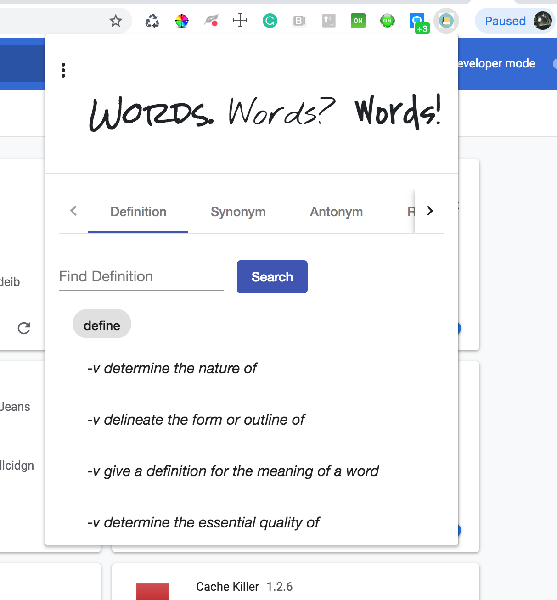

# ChromeAngular

Angular with Typescript, Bootstrap, Materials, and [Datamuse API](https://www.datamuse.com/api/).

## Development server

Run `npm install`, update dependancies in `package.json`, and finally-- `ng serve` for a dev server. Navigate to `http://localhost:4200/`. The app will automatically reload if you change any of the source files. 

## Getting It Into Chrome

Run `ng build` to build the project, if the `dist` folder isn't present. The build artifacts will be stored in the `dist/`. create `manifest.json` in `dist/chrome-angular` to upload app to chrome.

## Wanna Check It Out In Browser?

`ng serve -o`

To get more help on the Angular CLI use `ng help` or go check out the [Angular CLI README](https://github.com/angular/angular-cli/blob/master/README.md).
# Angular-Chrome-Extension-Datamuse
